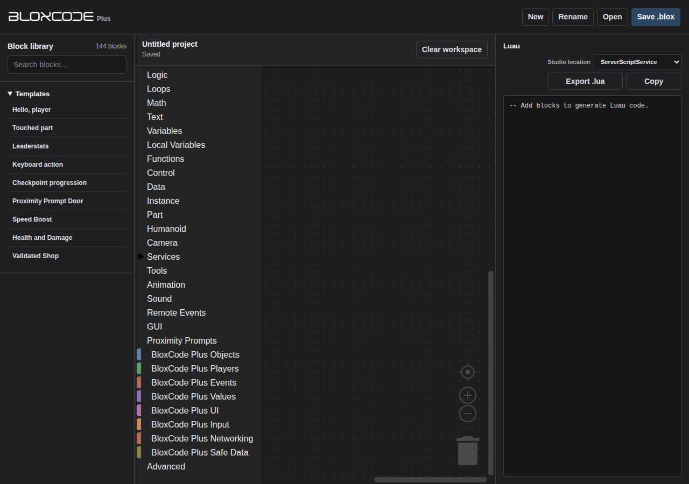

# BloxCode Plus

BloxCode Plus is a visual coding environment for Roblox Luau. Write Luau scripts by connecting blocks, then use the generated code in Roblox Studio.



## Latest release

The current public build is **Version 1.1** for Windows x64. Download [BloxCode-Plus-Windows-x64.zip](https://github.com/projectx667/bloxcode-plus/releases/tag/v1.1), extract it, and run `BloxCode Plus.exe`. A SHA-256 file is included for verification.

## Initial Release

The original first public build remains available as the [Initial Release](https://github.com/projectx667/bloxcode-plus/releases/tag/v1.0.0).

## What it includes

The editor combines standard Blockly categories with Roblox blocks for players, objects, interactions, GUI, input, RemoteEvents, tools, sound, animation and DataStore workflows. Projects are saved as `.blox` files together with their selected Studio location. The application also includes nine built-in Templates.

## Documentation

[Using BloxCode Plus](./docs/using-bloxcode-plus.md) covers the workspace, block library, script locations and project files.

[Templates](./docs/examples.md) lists and describes all nine built-in Templates.

## Community

Use [Issues](https://github.com/projectx667/bloxcode-plus/issues) for reproducible bugs, compatibility reports and block requests. Use [Discussions](https://github.com/projectx667/bloxcode-plus/discussions) for workflows, examples and feedback.

## Project and source

BloxCode Plus began from [BloxCode](https://github.com/wolfgangmeyers/bloxcode) and is maintained as its own codebase. It does not aim to expose every Roblox API.

### Build from source

```shell
git clone https://github.com/projectx667/bloxcode-plus.git
cd bloxcode-plus/app
npm install
npm start
```

Run `npm run package` to create a desktop package. Original BloxCode Plus contributions use the proprietary [LICENSE](./LICENSE). BloxCode and third-party components retain their own terms in [THIRD_PARTY_NOTICES.md](./THIRD_PARTY_NOTICES.md).
